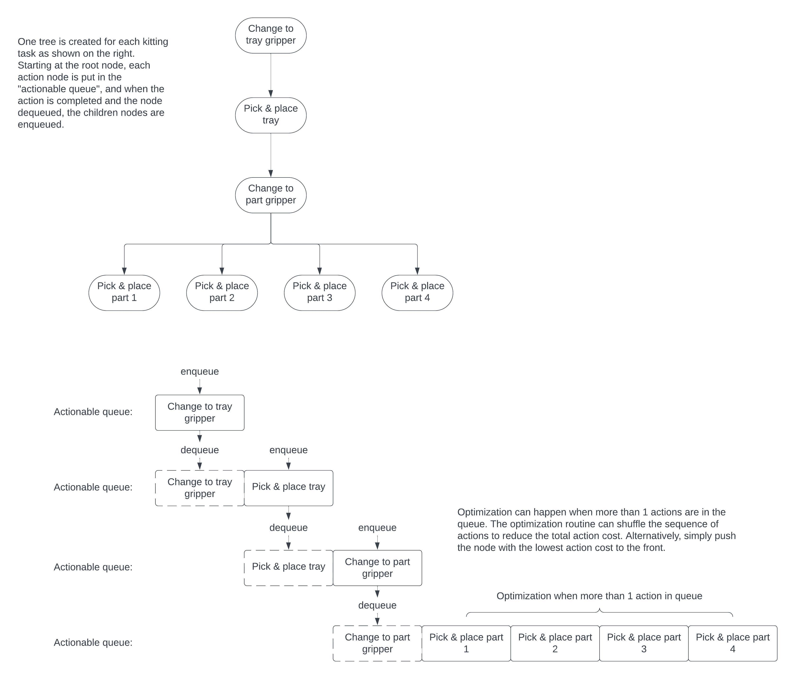

# RWA67 Group 1

In this assignment, we created a custom tree data structure to represent each kitting task. Each node in the tree represents one of two types of actions, i.e., "change gripper", and "pick and place". The tree is built such that the parent node is the prerequisite of the child node as the parent node needs to be executed first before the child nodes are executed. 

For managing execution, a separate queue is used, and each node is pushed onto the queue before being executed. At each iteration, the front node of the queue is executed, after which all its child nodes are enqueued. This strategy will ensure the proper sequence of actions as represented by the tree structure. 

In addition, each node has an associated cost that consists of two parts: distance to travel for the robot and whether gripper needs to be changed. We panelize gripper change by associating it with a large cost, and as such the robot will try to finish all available actions that is compatible with the current gripper configuration before switching. Each time new actions are enqueued, the costs of all actions in the queue are updated and the queue sequence is sorted in the ascending order. Therefore, the task planning performs greedily with respect to the short-term action costs, which is relevant when the robot performs two or more kitting tasks simultaneously. The task planning scheme is also illustrated in the following figure.

